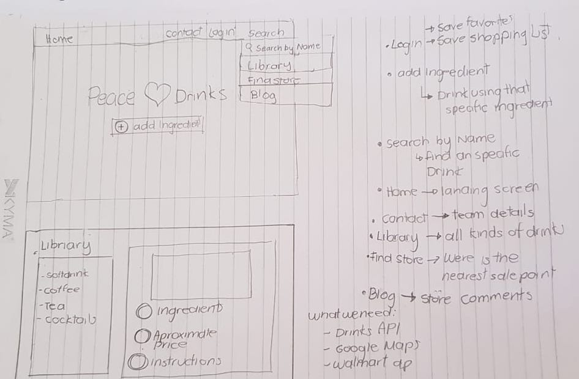

# Tortilla-Tracker

## Project Title: 
Peace ♥ Beer
## Team Name: 
Tortilla Tracker
## Team Members:
* Verónica Velez
* Javier Lozano
* Mario Reyes
* Elizabeth Jimenez
## Project description:
Web application that:
* Has user authentication (registration|sign on).
* Finds recipes to use ingredients if you already have them.
* Match drink recipe with any kind of cuisine.
* Get approximate product price as per selected recipe.
* Accepts user reviews and ratings.
Bonus:
* Find walmart products near you.
* Find your way home.
## Sketch of final product:

## API's to be used:
* https://www.thecocktaildb.com/api/json/v1/1/filter.php?a=Alcoholic
* Walmart API
## Tasks:
- [ ] Create mockup design - Responsible: Javier
- [ ] Database handling research (Login/SignUp) - Veronica
- [ ] Google Maps API research - Elizabeth
- [ ] Drinks API research - Mario
## URL: 
https://veritosvb.github.io/Tortilla-Tracker/
